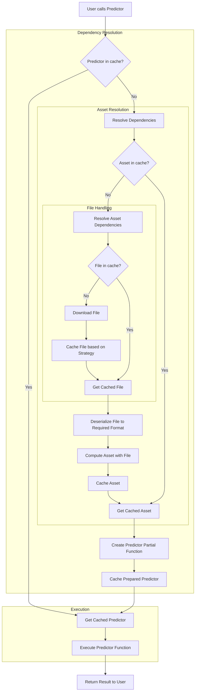

<p align="center">
    
</p>
<h1 align="center"> daidai 🍊</h1>
<p align="center">
  <em>Modern dependency & assets management library for MLOps</em>
</p>

<p align="center">
<a href="https://github.com/antoinejeannot/daidai/actions/workflows/tests.yml"></a>
<a href="https://pypi.org/project/daidai/"></a>
<a href="https://pypi.org/project/daidai/"></a>
<a href="https://github.com/antoinejeannot/daidai/blob/main/LICENSE"></a>

</p>

**daidai 🍊** is a minimalist, type-safe dependency management system for AI/ML components that streamlines workflow development with dependency injection, intelligent caching and seamless file handling.

🚧 **daidai** is still very much a work in progress and is definitely not prod-ready. It is currently developed as a _[selfish software](https://every.to/source-code/selfish-software)_ to become my personal go-to MLOps library, but feel free to give it a try :) 🚧

<details open>
<summary>🎧 Stop reading, listen to daidai 🍊's podcast instead 🎙️</summary>

[](https://www.youtube.com/watch?v=ZFaAxzrvucc)

_Powered by [NotebookLM](https://notebooklm.google.com/notebook/e273780a-e0db-457f-bb5b-cca0778abe9d/audio)_
</details>

## Why daidai?

Built for both rapid prototyping and production ML workflows, **daidai 🍊**:

- 🚀 **Accelerates Development** - Reduces iteration cycles with zero-config caching
- 🧩 **Simplifies Architecture** - Define reusable components with clear dependencies
- 🔌 **Works Anywhere** - Seamless integration with cloud/local storage via fsspec (local, s3, gcs, az, ftp, hf..)
- 🧠 **Stays Out of Your Way** - Type-hint based DI means minimal boilerplate
- 🧹 **Manages Resources** - Automatic cleanup prevents leaks and wasted compute
- 🧪 **Enables Testing** - Inject mock dependencies / stubs with ease for robust unit testing
- 🪶 **Requires Zero Dependencies** - _Zero-dependency Core_ philosophy, install optionals at will
- λ **Promotes Functional Thinking** - Embraces pure functions, immutability, and composition for predictable workflows
- 🧰 **Adapts to Your Design** - pure functions enable seamless integration with your preferred caching, versioning, validation systems..


> **daidai** is named after the Japanese word for "orange" 🍊, a fruit that is both sweet and sour, just like the experience of managing dependencies in ML projects. <br/>It is being developed with user happiness in mind, while providing great flexibility and minimal boilerplate. It has been inspired by [pytest](https://github.com/pytest-dev/pytest), [modelkit](https://github.com/Cornerstone-OnDemand/modelkit), [dependency injection & testing](https://antoinejeannot.github.io/nuggets/dependency_injection_and_testing.html) principles and functional programming.


## Installation

```bash
# Core functionality of assets & predictors
pip install daidai

# Full installation with all features: artifacts, memory tracking, CLI
pip install daidai[all] # or any combination of [artifacts, memory, cli]
```

## Quick Start

```python
import base64
from typing import Annotated, Any

import openai

from daidai import ModelManager, asset, predictor

# Define assets which are long-lived objects
# that can be used by multiple predictors, or other assets
@asset
def openai_client(**configuration: dict[str, Any]) -> openai.OpenAI:
    return openai.OpenAI(**configuration)

# Fetch a distant file from HTTPS, but it can be from any source: local, S3, GCS, Azure, FTP, HF Hub, etc.
@asset
def dogo_picture(
    picture: Annotated[
        bytes,
        "https://images.pexels.com/photos/220938/pexels-photo-220938.jpeg",
        {"cache_strategy": "no_cache"},
    ],
) -> str:
    return base64.b64encode(picture).decode("utf-8")


# Define a predictor that depends on the previous assets
# which are automatically loaded and passed as an argument
@predictor
def ask(
    message: str,
    dogo_picture: Annotated[str, dogo_picture],
    client: Annotated[openai.OpenAI, openai_client, {"timeout": 5}],
    model: str = "gpt-4o-mini",
) -> str:
    response = client.chat.completions.create(
        messages=[
            {
                "role": "user",
                "content": [
                    {"type": "text", "text": message},
                    {
                        "type": "image_url",
                        "image_url": {
                            "url": f"data:image/jpeg;base64,{dogo_picture}",
                            "detail": "low",
                        },
                    },
                ],
            }
        ],
        model=model,
    )
    return response.choices[0].message.content

# daidai takes care of loading dependencies & injecting assets!
print(ask("Hello, what's in the picture ?"))
# >>> The picture features a dog with a black and white coat.

# Or manage lifecycle with context manager for production usage
# all predictors, assets and artifacts are automatically loaded and cleaned up
with ModelManager(preload=[ask]):
    print(ask("Hello, what's in the picture ?"))

# or manually pass dependencies
my_other_openai_client = openai.OpenAI(timeout=0.1)
print(ask("Hello, what's in the picture ?", client=my_other_openai_client))
# >>> openai.APITimeoutError: Request timed out.
# OOOPS, the new client timed out, of course :-)
```

You can visualize the dependency graph of the above code using the `daidai CLI`:

```
$ daidai list -m example.py

📦 Daidai Components
├── 📄 Artifacts
│   └── https://images.pexels.com/photos/220938/pexels-photo-220938.jpeg
│       ├── Cache strategies: no_cache
│       └── Used by:
│           └── dogo_picture (asset) as picture
├── 🧩 Assets
│   ├── openai_client
│   └── dogo_picture
│       └── Artifacts
│           └── picture: https://images.pexels.com/photos/220938/pexels-photo-220938.jpeg - Cache: no_cache
└── 🔮 Predictors
    └── ask
        └── Dependencies
            ├── dogo_picture: dogo_picture (asset) - default
            └── client: openai_client (asset) - timeout=5
```

## Roadmap

- [x] Clean things up now that the UX has landed
- [x] Protect file operations for parallelism / concurrency
- [ ] Add docs
- [ ] Add tests (unit, integration, e2e)
- [ ] Add a cookbook with common patterns & recipes
- [ ] Add support for async components
- [ ] Enjoy the fruits of my labor 🍊

# 🧠 Core Concepts

`daidai` is built around a few key concepts that work together to provide a streamlined experience for developing and deploying ML components. The following explains these core concepts and how they interact.

At the heart of `daidai` are three types of components: Assets, Predictors and Artifacts.

> **TL;DR** Predictors are functions that perform computations, Assets are long-lived objects that are expensive to create and should be reused, and Artifacts are the raw files, model weights, and other resources that assets transform into usable components.

## 🧩 Assets

Assets represent long-lived objects that are typically expensive to create and should be reused across multiple operations, e.g.:
_Loaded ML models (or parts of: weights etc.), Embedding models, Customer Configurations, Tokenizers, Database connections, API clients.._

Assets have several important characteristics:

1. They are computed once and cached, making them efficient for repeated use
2. They can depend on other assets or artifacts
3. They are automatically cleaned up when no longer needed
4. They can implement resource cleanup through generator functions

Assets are defined using the `@asset` decorator:

```python
@asset
def bert_model(
    model_path: Annotated[Path, "s3://models/bert-base.pt"]
) -> BertModel:
    return BertModel.from_pretrained(model_path)
```

## 🔮 Predictors

Predictors are functions that use assets to perform actual computations or predictions. Unlike assets:

1. They are not cached themselves
2. They are meant to be called repeatedly with different inputs
3. They can depend on multiple assets or even other predictors
4. They focus on the business logic of your application

Predictors are defined using the `@predictor` decorator:

```python
@predictor
def classify_text(
    text: str,
    model: Annotated[BertModel, bert_model],
    tokenizer: Annotated[Tokenizer, tokenizer]
) -> str:
    tokens = tokenizer(text)
    prediction = model(tokens)
    return prediction.label
```


## 📦 Artifacts

Artifacts represent the fundamental building blocks in your ML system - the raw files, model weights, configuration data, and other persistent resources that assets transform into usable components.
They are discrete, versioned resources that can be stored, tracked, and managed across various storage systems.

Artifacts have several important characteristics:

1. They represent raw data resources that require minimal processing to retrieve
2. They can be stored and accessed from a wide variety of storage systems
3. They support flexible caching strategies to balance performance and resource usage
4. They are automatically downloaded, cached, and managed by daidai
5. They can be deserialized into various formats based on your needs

Artifacts are defined using Python type annotations and are made vailable through the `artifacts` optional: `pip install daidai[artifacts]`

```python

@asset
def word_embeddings(
    embeddings_file: Annotated[
        Path,
        "s3://bucket/glove.txt",  # Artifact location
        {"cache_strategy": "on_disk"}
    ]
) -> Dict[str, np.ndarray]:
    with open(embeddings_file) as f:
        embeddings = {...}
        return embeddings
```

## 📦🧩🔮 Working Together

The true power of daidai emerges when `Artifacts`, `Assets`, and `Predictors` work together in a cohesive dependency hierarchy.

This architecture creates a natural progression from raw data to functional endpoints: `Artifacts` (raw files, model weights, configurations) are retrieved from storage systems, `Assets` transform these `artifacts` into reusable, long-lived objects, and `Predictors` utilize these `assets` to perform specific, **business-logic** computations.

This clean separation of concerns allows each component to focus on its specific role while forming part of a larger, integrated system.

## 💉 Dependency Injection

`daidai` uses a type-hint based dependency injection system that minimizes boilerplate while providing type safety. The system works as follows:

### Type Annotations

Dependencies are declared using Python's `Annotated` type from the `typing` module:

```python
param_name: Annotated[Type, Dependency, Optional[Configuration]]
```

Where:

- `Type` is the expected type of the parameter
- `Dependency` is the function that will be called to obtain the dependency
- `Optional[Configuration]` is an optional dictionary of configuration parameters

### Automatic Resolution

When you call a predictor or asset, `daidai` automatically:

1. Identifies all dependencies (predictors, assets and artifacts)
2. Resolves the dependency graph
3. Loads or retrieves cached dependencies
4. Injects them into your function

This happens transparently, so you can focus on your business logic rather than dependency management.

<details open>
<summary>Simple Dependency Resolution Flowchart</summary>

For a single predictor with one asset dependency having one file dependency, the dependency resolution flow looks like this:




</details>

### Manual Overrides

You can always override automatic dependency injection by explicitly passing values:

```python
# Normal automatic injection
result = classify_text("Sample text")

# Override with custom model
custom_model = load_my_custom_model()
result = classify_text("Sample text", model=custom_model)
```

This way, you can easily swap out components for testing, debugging, or A/B testing.

## 📦 Artifacts (in-depth)

### File Types

daidai supports various file types through type hints, allowing you to specify exactly how you want to interact with the artifact:

- `Path`: Returns a Path object pointing to the downloaded file, ideal for when you need to work with the file using standard file operations
- `str`: Returns the file content as a string, useful for text-based configurations or small text files
- `bytes`: Returns the file content as bytes, perfect for binary data like images or serialized models
- `TextIO`: Returns a text file handle (similar to `open(file, "r")`), best for streaming large text files
- `BinaryIO`: Returns a binary file handle (similar to `open(file, "rb")`), ideal for streaming large binary files
- `Generator[str]`: Returns a generator that yields lines from the file, optimal for processing large text files line by line
- `Generator[bytes]`: Returns a generator that yields chunks of binary data, useful for processing large binary files in chunks

### Cache Strategies

daidai offers multiple caching strategies for artifacts to balance performance, storage use, and reliability:

- `on_disk`: Download once and keep permanently in the cache directory. Ideal for stable artifacts that change infrequently.
- `on_disk_temporary`: Download to a temporary location, automatically deleted when the process exits. Best for large artifacts needed only for the current session.
- `no_cache`: Do not cache the artifact, fetch it each time. Useful for dynamic content that changes frequently or when running in environments with limited write permissions.

### Storage Systems

Thanks to `fsspec` integration, daidai supports a wide range of storage systems, allowing you to retrieve artifacts from virtually anywhere:

- Local file system for development and testing
- Amazon S3 for cloud-native workflows
- Google Cloud Storage for GCP-based systems
- Microsoft Azure Blob Storage for Azure environments
- SFTP/FTP for legacy or on-premises data
- HTTP/HTTPS for web-based resources
- Hugging Face Hub for ML models and datasets
- And many more through fsspec protocols

This unified access layer means your code remains the same regardless of where your artifacts are stored, making it easy to transition from local development to cloud deployment.

## 🧹 Resource Lifecycle Management

`daidai` automatically manages the lifecycle of resources to prevent leaks and ensure clean shutdown:

### Automatic Cleanup

For basic resources, assets are automatically released when they're no longer needed. For resources requiring explicit cleanup (like database connections), `daidai` supports generator-based cleanup:

```python
@asset
def database_connection(db_url: str):
    # Establish connection
    conn = create_connection(db_url)
    try:
        yield conn  # Return the connection for use
    finally:
        conn.close()  # This runs during cleanup
```

### ModelManager

The `ModelManager` class provides explicit control over component lifecycle and is the recommended way for production usage:

```python
# Preload components and manage their lifecycle
with ModelManager(preload=[classify_text]) as manager:
    # Components are ready to use
    result = classify_text("Sample input")
    # More operations...
# All resources are automatically cleaned up
```

ModelManager features:

- Preloading of components for predictable startup times
- Namespace isolation for managing different environments
- Explicit cleanup on exit
- Support for custom configuration

### Namespaces

`daidai` supports isolating components into namespaces, which is useful for:

- Running multiple model versions concurrently
- Testing with different configurations
- Implementing A/B testing

```python
# Production namespace
with ModelManager(preload=[model_v1], namespace="prod"):
    # Development namespace in the same process
    with ModelManager(preload=[model_v2], namespace="dev"):
        # Both can be used without conflicts
        prod_result = model_v1("input")
        dev_result = model_v2("input")
```

### Caching and Performance

`daidai` implements intelligent caching to optimize performance:

- Assets are cached based on their configuration parameters
- Artifacts use a content-addressed store for efficient storage
- Memory usage is tracked (when pympler is installed, `pip install daidai[memory]`)
- Cache invalidation is handled automatically based on dependency changes

This ensures your ML components load quickly while minimizing redundant computation and memory usage.

## 🔧 Environment Configuration

`daidai` can be configured through environment variables:

- `DAIDAI_CACHE_DIR`: Directory for persistent file cache
- `DAIDAI_CACHE_DIR_TMP`: Directory for temporary file cache
- `DAIDAI_DEFAULT_CACHE_STRATEGY`: Default strategy for file caching, so you don't have to specify it for each file
- `DAIDAI_FORCE_DOWNLOAD`: Force download even if cached versions exist
- `DAIDAI_LOG_LEVEL`: Logging verbosity level

## 🖥️ Command Line

daidai provides a CLI that helps you explore your components and their relationships, making it easier to understand your ML system's architecture & pipelines.

```bash
# Install the CLI
pip install daidai[cli]
```

### Commands

#### List Components

The `list` command displays all daidai components in your module, showing assets, predictors, and artifacts along with their dependencies and configurations:

```bash
# List all components in a module
daidai list -m [module.py] [assets|predictors|artifacts] [-c cache_strategy] [-f format]

```
The output provides a detailed view of your component graph, making it easy to visualize dependencies and configurations:

```
$ daidai list -m example.py

📦 Daidai Components
├── 📄 Artifacts
│   └── s3://bucket/model.pt
│       ├── Cache strategies: on_disk
│       └── Used by:
│           └── bert_model (asset) as model_path
├── 🧩 Assets
│   ├── bert_model
│   │   └── Artifacts
│   │       └── model_path: s3://bucket/model.pt - Cache: on_disk
│   └── tokenizer
│       └── Artifacts
│           └── vocab_file: s3://bucket/vocab.txt - Cache: on_disk
└── 🔮 Predictors
    └── classify_text
        └── Dependencies
            ├── model: bert_model (asset) - default
            └── tokenizer: tokenizer (asset) - default
```

This visualization helps you understand:
- Which artifacts are being used and their cache strategies
- How assets depend on artifacts and other assets
- How predictors compose multiple assets together

The CLI is particularly useful for:
- Documenting your ML system architecture
- Debugging dependency issues
- Understanding resource usage patterns
- Discovering optimization opportunities

You can also filter components by type or cache strategy, and customize the output format for easier integration with other tools.

##### Scenario: pre-caching artifacts for faster startup

```bash
daidai list -m example.py artifacts -c on_disk -f raw
```
Then, the **soon-to-be-built daidai cache command** will allow you to pre-cache / download all artifacts in the list to a specific directory, so you can build a Docker image with all dependencies pre-cached.

```bash
[previous command] | daidai cache -d /path/to/cache -
```

Then in your Dockerfile:

```Dockerfile
COPY /path/to/cache /path/to/cache
ENV DAIDAI_CACHE_DIR /path/to/cache
```

Et voilà, your service will start up faster as all artifacts are already downloaded and cached.

## 🧰 Adaptable Design

`daidai` embraces an adaptable design philosophy that provides core functionality while allowing for extensive customization and extension. This approach enables you to integrate `daidai` into your existing ML infrastructure without forcing rigid patterns or workflows.

### Pure Functions as Building Blocks

At its core, `daidai` uses pure functions decorated with `@asset` and `@predictor` rather than class hierarchies or complex abstractions:

```python
@asset
def embedding_model(model_path: Path) -> Model:
    return load_model(model_path)

@predictor
def embed_text(text: str, model: Annotated[Model, embedding_model]) -> np.ndarray:
    return model.encode(text)
```

This functional approach provides several advantages:

1. **Composability**: Functions can be easily composed together to create complex pipelines
2. **Testability**: Pure functions with explicit dependencies are straightforward to test
3. **Transparency**: The data flow between components is clear and traceable
4. **Interoperability**: Functions work with any Python object, not just specialized classes

### Integration with External Systems

You can easily integrate `daidai` with external systems and frameworks:

```python
# Integration with existing ML experiment tracking
import mlflow
@asset
def tracked_model(model_id: str, mlflow_uri: str) -> Model:
    mlflow.set_tracking_uri(mlflow_uri)
    model_uri = f"models:/{model_id}/Production"
    return mlflow.sklearn.load_model(model_uri)

# Integration with metrics collection
@predictor
def classified_with_metrics(
    text: str,
    model: Annotated[Model, classifier_model],
    metrics_client: Annotated[MetricsClient, metrics]
) -> str:
    result = model.predict(text)
    metrics_client.increment("prediction_count")
    metrics_client.histogram("prediction_latency", time.time() - start_time)
    return result
```

### Adding Your Own Capabilities

`daidai` can be extended with additional capabilities by composing with other libraries:

### Input/Output Validation with Pydantic

```python
# Apply validation to predictor
@predictor
@validate_call(validate_return=True)
def analyze_sentiment(
    text: TextInput,
    model: Annotated[Model, sentiment_model],
    min_length: int = 1
) -> SentimentResult:
    # Input has been validated
    result = model.predict(text)
    return SentimentResult(
        sentiment=result.label,
        confidence=result.score,
    ) # Output will be validated
```

### Performance Optimization with LRU Cache

```python
from functools import lru_cache

@lru_cache(maxsize=1000)
@predictor
def classify_text(
    text: str,
    model: Annotated[Model, classifier_model]
) -> str:
    # This result will be cached based on text if only text is provided (and model injected)
    return model.predict(text)

```

### Instrumentation and Observability

```python
from opentelemetry import trace
import time
from functools import wraps

tracer = trace.get_tracer(__name__)

def traced_predictor(func):
    """Decorator to add tracing to predictors"""
    @wraps(func)
    def wrapper(*args, **kwargs):
        with tracer.start_as_current_span(func.__name__):
            return func(*args, **kwargs)
    return wrapper

def timed_predictor(func):
    """Decorator to measure and log execution time"""
    @wraps(func)
    def wrapper(*args, **kwargs):
        start_time = time.perf_counter()
        result = func(*args, **kwargs)
        execution_time = time.perf_counter() - start_time
        print(f"{func.__name__} executed in {execution_time:.4f} seconds")
        return result
    return wrapper

@predictor
@traced_predictor
@timed_predictor
def predict_with_instrumentation(
    text: str,
    model: Annotated[Model, model]
) -> str:
    # This call will be traced and timed
    return model.predict(text)
```

### Replacing Components

The dependency injection system allows you to replace components at runtime without modifying any code:

```python
# Normal usage with automatic dependency resolution
result = embed_text("Example text")

# Replace the embedding model for A/B testing
experimental_model = load_experimental_model()
result_b = embed_text("Example text", model=experimental_model)

# Replace for a specific use case
small_model = load_small_model()
batch_results = [embed_text(t, model=small_model) for t in large_batch]
```

`daidai`'s adaptable design ensures that you can build ML systems that meet your specific requirements while still benefiting from the core dependency management and caching features. Whether you're working on a simple prototype or a complex production system, `daidai` provides the flexibility to adapt to your needs without getting in your way.

## 🧵 Concurrency & Parallelism

While file operations are protected against race conditions (downloading, caching etc.), other operations **are not** due to the lazy nature of component loading.
As such, `daidai` cannot be considered thread-safe and does not plan to in the short term.

However, there are ways to work around this limitation for multi-threaded applications:

1. Create a shared `ModelManager` instance for all threads, but ensure that components are loaded before the threads are started:

```python
@asset
def model(model_path: Annotated[Path, "s3://bucket/model.pkl"]) -> Model:
    with open(model_path, "rb") as f:
        return pickle.load(f)

@predictor
def sentiment_classifier(text: str, model: Annotated[Model, model]):
    return model.predict(text)


with ModelManager(preload=[sentiment_classifier]) as manager:
    # sentiment_classifier and its dependencies (model) are loaded and
    # ready to be used by all threads without issues
    with ThreadPoolExecutor(max_workers=4) as executor:
        results = list(executor.map(worker_function, data_chunks))
```

2. Create a separate `ModelManager` instance for each thread, each will benefit from the same disk cache but will not share components:

```python
# same predictor & asset definitions as above

def worker_function(data_chunk):
    # Each thread has its own manager and namespace
    with ModelManager(namespace=str(threading.get_ident())) as manager:
        return my_predictor(data)

with ThreadPoolExecutor(max_workers=4) as executor:
    results = list(executor.map(worker_function, data_chunks))
```

A few notes:

- Creating separate ModelManager instances (approach #2) might lead to duplicate loading of the same components in memory across threads, while preloading (approach #1) ensures components are shared but requires knowing & loading all components in advance.
- For most applications, approach #2 (separate managers) provides the safest experience, while approach #1 (preloading) is more memory-efficient and simple to implement for applications with large models.
- Both approaches benefit from disk caching, so artifacts are only downloaded once regardless of how many ModelManager instances you create.

## 🧪 Testing

`daidai`'s design makes testing ML components straightforward and effective. The dependency injection pattern allows for clean separation of concerns and easy mocking of dependencies.

### Unit Testing Components

When unit testing assets or predictors, you can manually inject dependencies:

```python
def test_text_classifier():
    # Create a mock model that always returns "positive"
    mock_model = lambda text: "positive"

    # Pass the mock directly instead of using the real model
    result = classify_text("Great product!", model=mock_model)

    assert result == "positive"
```

### Testing with Fixtures

In pytest, you can create fixtures that provide mock assets:

```python
import pytest

@pytest.fixture
def mock_embedding_model():
    # Return a simplified embedding model for testing
    return lambda text: np.ones(768) * 0.1

def test_semantic_search(mock_embedding_model):
    # Use the fixture as a dependency
    results = search_documents(
        "test query",
        embedding_model=mock_embedding_model
    )
    assert len(results) > 0
```

### Integration Testing

For integration tests that verify the entire component pipeline:

```python
@pytest.fixture(scope="module")
def test_model_manager():
    # Set up a test namespace with real components
    with ModelManager(
        preload=[classify_text],
        namespace="test"
    ) as manager:
        yield manager

def test_end_to_end_classification(test_model_manager):
    # This will use real components in the test namespace
    result = classify_text("Test input")
    assert result in ["positive", "negative", "neutral"]
```

### Testing Artifacts

For artifacts, you can use local test files:

```python
@asset
def test_embeddings(
    embeddings_file: Annotated[
        Path,
        "file:///path/to/test_embeddings.npy"
    ]
) -> np.ndarray:
    return np.load(embeddings_file)

# In your test
def test_with_test_embeddings():
    result = embed_text("test", embeddings=test_embeddings())
    assert result.shape == (768,)
```

`daidai`'s flexible design ensures that your ML components remain testable at all levels, from unit tests to integration tests, without requiring complex mocking frameworks or test setup.


## 📚 Resources

- [daidai 🍊 Documentation](https://antoinejeannot.github.io/daidai/)
- [daidai 🍊 GitHub Repository](https://github.com/antoinejeannot/daidai/)
- [daidai 🍊 PyPI Package](https://pypi.org/project/daidai/)


## 📝 License

This project is licensed under the MIT License - see the [LICENSE](https://github.com/antoinejeannot/daidai/blob/main/LICENSE) file for details.
