```mermaid
graph LR
    palisades_ingest_target["palisades<br>ingest -<br>target=&lt;target&gt; -<br>predict - - - -<br>to=&lt;runner&gt;"]

    palisades_ingest_query["palisades<br>ingest -<br>&lt;query-object-name&gt; -<br>predict - - - -<br>to=&lt;runner&gt;"]

    palisades_label["palisades<br>label<br>offset=&lt;offset&gt; -<br>&lt;query-object-name&gt;"]

    palisades_train["palisades<br>train -<br>&lt;query-object-name&gt; -<br>&lt;dataset-object-name&gt; -<br>&lt;model-object-name&gt;"]

    palisades_predict["palisades<br>predict - - -<br>&lt;model-object-name&gt;<br>&lt;datacube-id&gt;<br>&lt;prediction-object-name&gt;"]

    palisades_buildings_download_footprints["palisades<br>buildings<br>download_footprints -<br>&lt;input-object-name&gt; -<br>&lt;output-object-name&gt;"]

    palisades_buildings_analyze["palisades<br>buildings<br>analyze -<br>&lt;prediction-object-name&gt;"]

    palisades_analytics_ingest["palisades<br>analytics<br>ingest -<br>&lt;analytics-object-name&gt;"]

    palisades_analytics_ingest_building["palisades<br>analytics<br>ingest_building<br>building=&lt;building-id&gt;<br>&lt;analytics-object-name&gt;"]

    target["🎯 target"]:::folder
    query_object["📂 query object"]:::folder
    datacube["🧊 datacube"]:::folder
    dataset_object["🏛️ dataset object"]:::folder
    model_object["🏛️ model object"]:::folder
    prediction_object["📂 prediction object"]:::folder
    analytics_object["📂 analytics object"]:::folder

    query_object --> datacube

    target --> palisades_ingest_target
    palisades_ingest_target --> palisades_ingest_query
    palisades_ingest_target --> query_object

    query_object --> palisades_ingest_query
    palisades_ingest_query --> palisades_predict

    query_object --> palisades_label
    palisades_label --> datacube

    datacube --> palisades_train
    query_object --> palisades_train
    palisades_train --> dataset_object
    palisades_train --> model_object

    model_object --> palisades_predict
    datacube --> palisades_predict
    palisades_predict --> palisades_buildings_download_footprints
    palisades_predict --> palisades_buildings_analyze
    palisades_predict --> prediction_object

    prediction_object --> palisades_buildings_download_footprints
    palisades_buildings_download_footprints --> prediction_object

    datacube --> palisades_buildings_analyze
    prediction_object --> palisades_buildings_analyze
    palisades_buildings_analyze --> prediction_object

    prediction_object --> palisades_analytics_ingest
    palisades_analytics_ingest --> analytics_object

    analytics_object --> palisades_analytics_ingest_building
    palisades_analytics_ingest_building --> analytics_object

    classDef folder fill:#999,stroke:#333,stroke-width:2px;
```

# 🧑🏽‍🚒 `palisades`

🧑🏽‍🚒 Post-disaster land Cover classification using [Semantic Segmentation](https://github.com/kamangir/roofai) on [Maxar Open Data](https://github.com/kamangir/blue-geo/tree/main/blue_geo/catalog/maxar_open_data) acquisitions. 

```bash
pip install palisades
```



<details>
<summary>palisades help</summary>

```bash
palisades \
	ingest \
	[~download,dryrun] \
	[target=<target> | <query-object-name>] \
	[~ingest | ~copy_template,dryrun,overwrite,scope=<scope>,upload] \
	[predict,count=<count>,~tag] \
	[device=<device>,profile=<profile>,upload] \
	[-|<model-object-name>] \
	[~download_footprints | country_code=<iso-code>,country_name=<country-name>,overwrite,source=<source>] \
	[~analyze | buffer=<buffer>,count=<count>] \
	[~submit | dryrun,to=<runner>]
 . ingest <target>.
   target: Altadena | Altadena-100 | Altadena-test | Borger | Borger-250 | Borger-test | Brown-Mountain-Truck-Trail | Brown-Mountain-Truck-Trail-all | Brown-Mountain-Truck-Trail-test | LA | LA-250 | LA-test | Noto | Noto-250 | Noto-test | Palisades-Maxar | Palisades-Maxar-100 | Palisades-Maxar-test
   scope: all + metadata + raster + rgb + rgbx + <.jp2> + <.tif> + <.tiff>
      all: ALL files.
      metadata (default): any < 1 MB.
      raster: all raster.
      rgb: rgb.
      rgbx: rgb and what is needed to build rgb.
      <suffix>: any *<suffix>.
   device: cpu | cuda
   profile: FULL | DECENT | QUICK | DEBUG | VALIDATION
   country-name: for Microsoft, optional, overrides <iso-code>.
   iso-code: Country Alpha2 ISO code: https://en.wikipedia.org/wiki/List_of_ISO_3166_country_codes
      Canada: CA
      US: US
   source: microsoft | osm | google
   calls: https://github.com/microsoft/building-damage-assessment/blob/main/download_building_footprints.py
   buffer: in meters.
   runner: aws_batch | generic | local
```
```bash
palisades \
	label \
	[download,offset=<offset>] \
	[~download,dryrun,~QGIS,~rasterize,~sync,upload] \
	[.|<query-object-name>]
 . label <query-object-name>.
```
```bash
palisades \
	train \
	[dryrun,~download,review] \
	[.|<query-object-name>] \
	[count=<10000>,dryrun,upload] \
	[-|<dataset-object-name>] \
	[device=<device>,dryrun,profile=<profile>,upload,epochs=<5>] \
	[-|<model-object-name>]
 . train palisades.
   device: cpu | cuda
   profile: FULL | DECENT | QUICK | DEBUG | VALIDATION
```
```bash
palisades \
	predict \
	[~tag] \
	[~ingest | ~copy_template,dryrun,overwrite,scope=<scope>,upload] \
	[device=<device>,profile=<profile>,upload] \
	[-|<model-object-name>] \
	[.|<datacube-id>] \
	[-|<prediction-object-name>] \
	[~download_footprints | country_code=<iso-code>,country_name=<country-name>,overwrite,source=<source>] \
	[~analyze | buffer=<buffer>,count=<count>]
 . <datacube-id> -<model-object-name>-> <prediction-object-name>
   device: cpu | cuda
   profile: FULL | DECENT | QUICK | DEBUG | VALIDATION
   country-name: for Microsoft, optional, overrides <iso-code>.
   iso-code: Country Alpha2 ISO code: https://en.wikipedia.org/wiki/List_of_ISO_3166_country_codes
      Canada: CA
      US: US
   source: microsoft | osm | google
   calls: https://github.com/microsoft/building-damage-assessment/blob/main/download_building_footprints.py
   buffer: in meters.
```
```bash
palisades \
	analytics \
	ingest \
	[acq_count=<-1>,building_count=<-1>,damage=<0.1>,dryrun,upload] \
	[-|<object-name>]
 . ingest analytics.
palisades \
	analytics \
	ingest_building \
	[acq_count=<-1>,building_count=<-1>,building=<building-id>,deep,~download,dryrun,upload] \
	[.|<object-name>]
 . ingest building analytics.
```

</details>

|   |   |   |
| --- | --- | --- |
| [`STAC Catalog: Maxar Open Data`](https://github.com/kamangir/blue-geo/tree/main/blue_geo/catalog/maxar_open_data) [](https://github.com/kamangir/blue-geo/tree/main/blue_geo/catalog/maxar_open_data) ["Satellite imagery for select sudden onset major crisis events"](https://www.maxar.com/open-data/) | [`Vision Algo: Semantic Segmentation`](https://github.com/kamangir/palisades/blob/main/palisades/docs/step-by-step.md) [](https://github.com/kamangir/palisades/blob/main/palisades/docs/step-by-step.md) [segmentation_models.pytorch](https://github.com/qubvel-org/segmentation_models.pytorch) | [`Building Damage Analysis`](https://github.com/kamangir/palisades/blob/main/palisades/docs/building-analysis.md) [](https://github.com/kamangir/palisades/blob/main/palisades/docs/building-analysis.md) using Microsoft, OSM, and Google footprints through [microsoft/building-damage-assessment](https://github.com/microsoft/building-damage-assessment) |
| [`Analytics`](https://github.com/kamangir/palisades/blob/main/palisades/docs/damage-analytics.md) [](https://github.com/kamangir/palisades/blob/main/palisades/docs/damage-analytics.md) per-building multi-observation damage analytics. | [`Los Angeles Wild Fires, Jan 25`](https://github.com/kamangir/palisades/blob/main/palisades/docs/WildFires-LosAngeles-Jan-2025.md) [](https://github.com/kamangir/palisades/blob/main/palisades/docs/WildFires-LosAngeles-Jan-2025.md) `2,685.88` sq. km = `1,148,351` buildings processed -> `10,133` with fire damage found. |  |

## Acknowledgments
 
1. The concept and workflow of this tool is heavily affected by [microsoft/building-damage-assessment](https://github.com/microsoft/building-damage-assessment).
2. `palisades buildings download_footprints` calls [`download_building_footprints.py`](https://github.com/microsoft/building-damage-assessment/blob/main/download_building_footprints.py).
3. `palisades buildings analyze` is based on [`merge_with_building_footprints.py`](https://github.com/microsoft/building-damage-assessment/blob/main/merge_with_building_footprints.py).
4. Through [satellite-image-deep-learning](https://www.satellite-image-deep-learning.com/p/building-damage-assessment).

---


[](https://github.com/kamangir/palisades/actions/workflows/pylint.yml) [](https://github.com/kamangir/palisades/actions/workflows/pytest.yml) [](https://github.com/kamangir/palisades/actions/workflows/bashtest.yml) [](https://pypi.org/project/palisades/) [](https://pypistats.org/packages/palisades)

built by 🌀 [`blue_options-4.227.1`](https://github.com/kamangir/awesome-bash-cli), based on 🧑🏽‍🚒 [`palisades-4.345.1`](https://github.com/kamangir/palisades).
